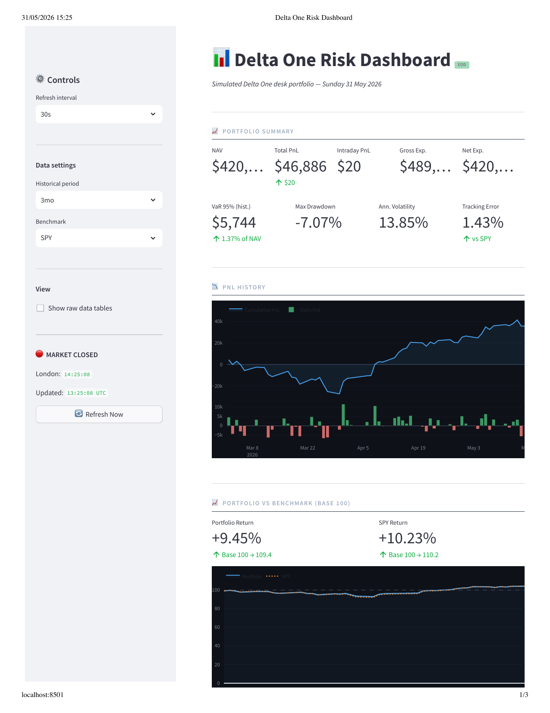
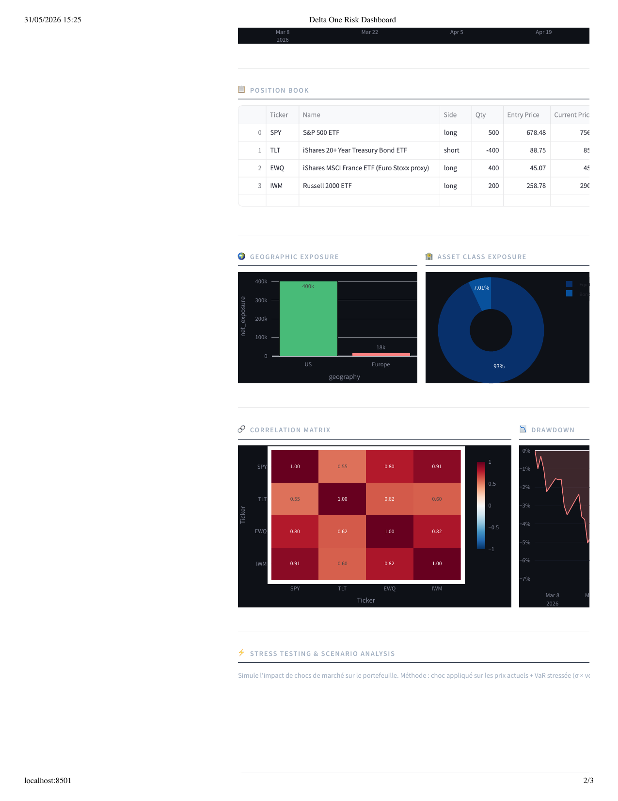
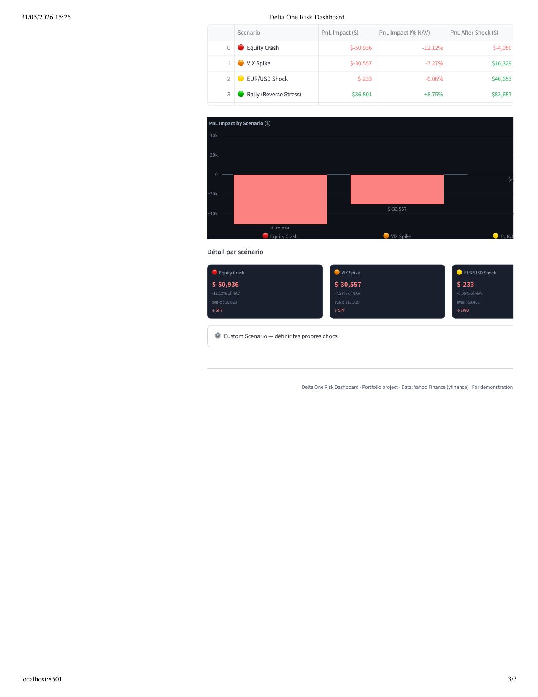

# 📊 Real-Time Delta One Risk Dashboard

> A cloud-native portfolio risk monitoring tool simulating a Delta One desk infrastructure.
> Built for portfolio demonstration — shows real-time PnL, risk metrics, and market exposure.


---

## 📸 Preview







---

## 🎯 Project Overview

Delta One desks trade products whose value moves one-for-one with an underlying asset: ETFs,
index futures, swaps, and equity baskets. Real-time risk monitoring is critical — this project
replicates the core functionality of a desk risk tool in a simplified, deployable form.

**What it does:**
- Fetches live market data (Yahoo Finance / yfinance) for a simulated ETF portfolio
- Calculates PnL, gross/net exposure, beta, VaR, drawdown, and tracking error
- Displays all metrics in a professional Streamlit dashboard with auto-refresh
- Persists data in SQLite (upgradeable to AWS RDS PostgreSQL)
- Fully containerized with Docker, designed for AWS deployment

---

## 🏗️ Architecture

```
Market Data (yfinance)
        │
        ▼
  market_data.py ──► database.py (SQLite / PostgreSQL)
        │
        ▼
  portfolio.py ──► pnl.py ──► risk.py
        │
        ▼
  Streamlit Dashboard (app/dashboard.py)
        │
        ▼
  Docker Container ──► AWS ECS Fargate
```

See [`architecture.md`](architecture.md) for the full technical architecture including
the cloud target stack (AWS S3, RDS, ECS, Kinesis).

---

## 📦 Portfolio

Simulated Delta One portfolio:

| Ticker | Name | Side | Qty | Rationale |
|--------|------|------|-----|-----------|
| SPY | S&P 500 ETF | Long | +500 | Core US equity exposure |
| TLT | 20+ Year Treasury Bond ETF | Short | -400 | Rates hedge — bonds fall when rates rise |
| EWQ | iShares MSCI France ETF | Long | +400 | European equity exposure |
| IWM | Russell 2000 ETF | Long | +200 | US small cap diversification |

Indicators (not positions): `^VIX`, `EURUSD=X`

---

## 📐 Risk Metrics Computed

| Metric | Method |
|--------|--------|
| PnL (total, intraday, by position) | `(P_current - P_entry) × Qty` |
| Gross / Net Exposure | Sum of absolute / algebraic market values |
| Portfolio Beta | Weighted sum of individual betas vs SPY |
| Rolling Volatility | `std(returns, 20d) × √252` |
| Value at Risk (95%) | Historical + Parametric |
| Maximum Drawdown | `(P_t - max(P)) / max(P)` |
| Correlation Matrix | Pearson on daily log returns |
| Tracking Error | `std(R_portfolio - R_benchmark) × √252` |
| Sharpe Ratio | `(R_portfolio - R_rf) / σ × √252` |
| Sortino Ratio | `(R_portfolio - R_rf) / σ_downside × √252` |
| NAV vs Benchmark | Normalized to 100 at inception |
| Stress Testing | 4 scenarios + custom sliders (sVaR) |

---

## 🚀 Quick Start

### 1. Local (without Docker)

```bash
# Clone
git clone https://github.com/your-username/real-time-delta-one-risk-dashboard.git
cd real-time-delta-one-risk-dashboard

# Create virtual environment
python -m venv venv
source venv/bin/activate  # Windows: venv\Scripts\activate

# Install dependencies
pip install -r requirements.txt

# Run dashboard
streamlit run app/dashboard.py
```

Open [http://localhost:8501](http://localhost:8501)

### 2. Docker

```bash
# Build and run
docker-compose up --build

# Or with PostgreSQL
docker-compose --profile postgres up --build
```

### 3. Run tests

```bash
pytest tests/ -v --cov=src
```

---

## 📁 Project Structure

```
real-time-delta-one-risk-dashboard/
│
├── app/
│   └── dashboard.py          # Streamlit dashboard (main UI)
│
├── src/
│   ├── market_data.py        # Data ingestion (yfinance + simulation)
│   ├── portfolio.py          # Position management & exposures
│   ├── pnl.py                # PnL calculations
│   ├── risk.py               # VaR, beta, vol, drawdown, correlation
│   ├── database.py           # SQLite / PostgreSQL persistence
│   └── utils.py              # Config, logging, formatting helpers
│
├── config/
│   └── config.yaml           # Portfolio, risk parameters, DB config
│
├── tests/
│   └── test_risk.py          # Unit tests (pytest)
│
├── data/                     # SQLite database and CSVs (gitignored)
├── logs/                     # Application logs (gitignored)
│
├── Dockerfile
├── docker-compose.yml
├── requirements.txt
├── .env.example
├── architecture.md           # Full technical architecture
└── README.md
```

---

## ⚙️ Configuration

Edit `config/config.yaml` to customize:
- Portfolio positions (tickers, quantities, entry prices)
- Risk thresholds (VaR limit, drawdown limit, leverage limit)
- Database backend (SQLite → PostgreSQL for cloud)
- Data source and historical lookback period

---

## ☁️ Cloud Deployment (AWS)

### Target Architecture

| Service | Role |
|---------|------|
| AWS ECS Fargate | Run the Streamlit app container |
| AWS RDS PostgreSQL | Production database |
| AWS S3 | Store historical price data |
| AWS ECR | Docker image registry |
| AWS ALB | Load balancer & HTTPS |
| AWS Kinesis | Real-time price streaming (v2) |
| Terraform | Infrastructure as Code |

### Deploy to ECS (overview)

```bash
# 1. Build and push image to ECR
aws ecr get-login-password | docker login --username AWS --password-stdin <ecr-url>
docker build -t delta-one-dashboard .
docker tag delta-one-dashboard:latest <ecr-url>/delta-one-dashboard:latest
docker push <ecr-url>/delta-one-dashboard:latest

# 2. Deploy with Terraform (terraform/ directory — Phase 3)
cd terraform/
terraform init && terraform apply
```

---

## 🗺️ Roadmap

### Phase 1 — MVP ✅
- [x] Market data ingestion (yfinance)
- [x] Portfolio PnL calculation
- [x] Risk metrics (VaR, beta, vol, drawdown)
- [x] Streamlit dashboard
- [x] SQLite persistence
- [x] Docker container

### Phase 2 — Enhanced
- [ ] Intraday data (1-minute bars)
- [ ] Position blotter with trade history
- [ ] Scenario analysis (stress tests: -10%, +VIX shock)
- [ ] Export to PDF / Excel
- [ ] Email alerts via AWS SNS

### Phase 3 — Cloud Production
- [ ] AWS ECS Fargate deployment
- [ ] AWS RDS PostgreSQL
- [ ] AWS S3 for historical data
- [ ] AWS Kinesis for streaming
- [ ] Terraform IaC
- [ ] CI/CD with GitHub Actions → ECR → ECS

---

## 🧪 Testing

```bash
# Run all tests
pytest tests/ -v

# With coverage
pytest tests/ -v --cov=src --cov-report=html
```

---

## 📝 Disclaimer

This project is for educational and portfolio demonstration purposes only.
Data comes from Yahoo Finance via the open-source `yfinance` library.
Nothing here constitutes financial advice or a real trading system.

---

## 👤 Author

Built as a personal portfolio project to demonstrate understanding of:
- Delta One products and desk workflows
- Real-time financial data pipelines
- Risk metric computation (VaR, beta, drawdown)
- Cloud-native application design
- Python financial engineering
